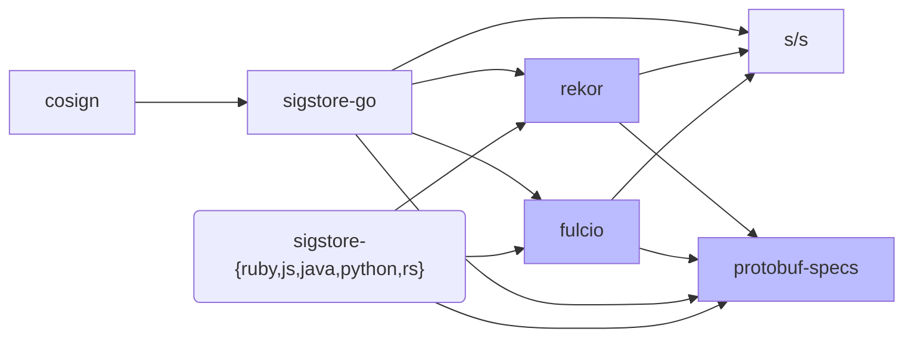

# sigstore-go 

This is a Go client library for [Sigstore](https://sigstore.dev/).

The project is under early development and **you shouldn't depend on it** yet. In the long run, you should depend on sigstore-go instead of cosign or sigstore/sigstore if you need a Sigstore Go client library, but don't need support for OCI registries/containers. Use cosign if you need OCI support, or if you're looking for a CLI signing/verification tool.

## Sigstore Library Landscape

*This section describes the desired end state after sigstore-go is complete, not the current state.*

These are the dependency relationships for library projects under the [Sigstore organization](https://github.com/sigstore) ("s/s" is [sigstore/sigstore](https://github.com/sigstore/sigstore); darker-background libraries are shared across language ecosystems).

See [Sigstore in Golang](https://docs.google.com/document/d/1aZfk1TlzcuaO0uz76M9D26-gAvoZLn0oCAKvkbuhcPM/edit) for design rationale; you may need to join sigstore-dev@googlegroups.com for access. We have:

* Infrastructure
  * [fulcio](https://github.com/sigstore/fulcio): The CA for Sigstore. Contains the Fulcio server implementation along with a basic generated client library. 
  * [rekor](https://github.com/sigstore/rekor): The artifact log for Sigstore. Contains the Rekor server implementation along with a basic generated client library.
  * [protobuf-specs](https://github.com/sigstore/protobuf-specs): Definitions for common Sigstore data formats.
* Golang
  * [sigstore/sigstore](https://github.com/sigstore/sigstore): Common code, used in both the infrastructure and clients.
  * sigstore-go: a Golang client library for Sigstore.
  * [cosign](https://github.com/sigstore/cosign): A library for using Sigstore to sign container images in OCI registries (along with a CLI). This is a relatively thin wrapper around sigstore-go.
* Other language clients.

## Security

Should you discover any security issues, please refer to Sigstore's [security
process](https://github.com/sigstore/sigstore-go/security/policy).
